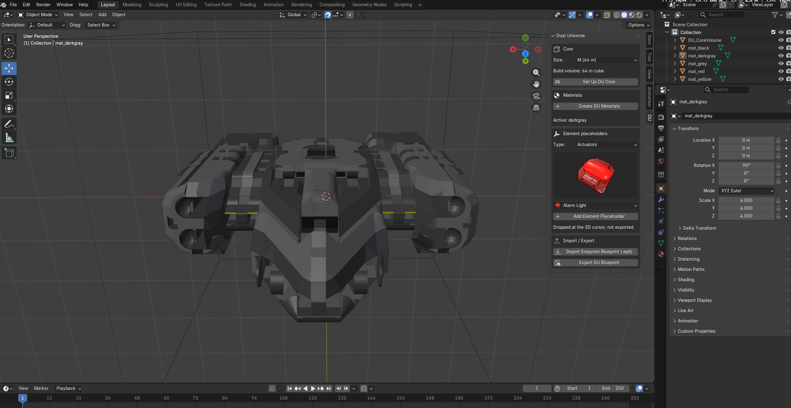
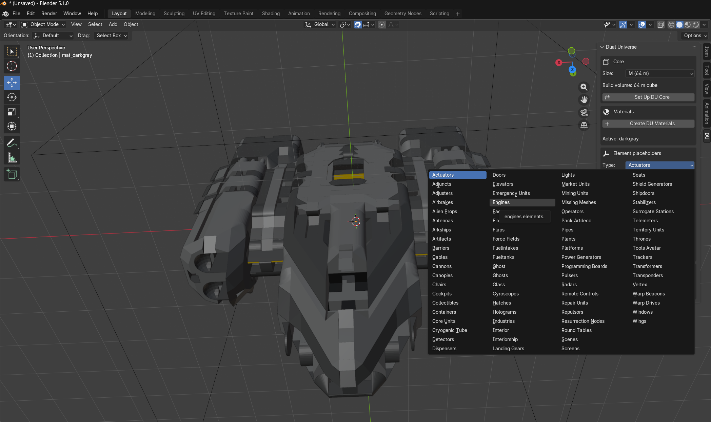
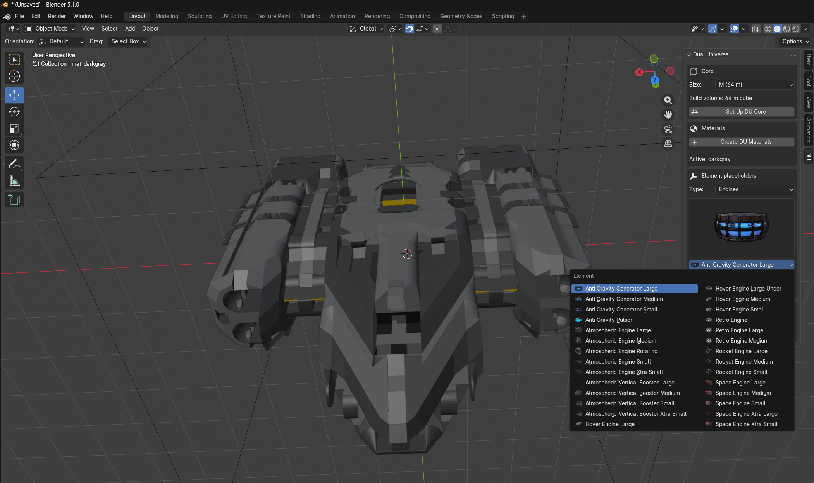
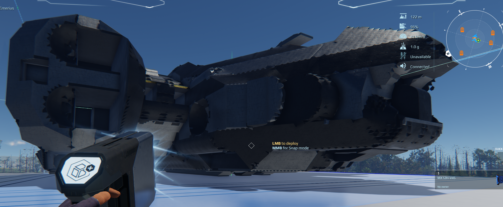

# DU Ship Builder — Blender → Dual Universe

Model your Dual Universe ship in Blender and export it straight to a `.blueprint`.
Building in-game is slow; this lets you sculpt the hull in a real 3D tool, paint it,
check element fitment, and import the result.

> ⚠️ **Beta / not pixel-perfect.** The exporter voxelizes your mesh onto DU's 0.25 m grid, so
> the import is a faithful *approximation* of what you model. Cleaning up a few spots
> in-game is still far faster than building the whole shape by hand.

---

## See it in action

**1. Import an Empyrion blueprint straight into Blender** (or model from scratch):



**2. Place real DU elements as fitment guides** — every category, with the real in-game
icons and readable names, sized to the actual part dimensions:




**3. Export, then deploy in Dual Universe:**



---

## Features
- **Pick a core size** (XS–XXXL) and get a correctly-sized build-volume box, with metric
  units and 0.25 m grid snapping.
- **Paint with the DU palette** — honeycomb colours mapped to in-game materials.
- **Element placeholders** — drop correctly-sized proxies of any engine, wing, container,
  seat, cannon, fuel tank, etc., with the real in-game icon, to check fitment.
- **One-click export** to a `.blueprint` you import in DU. **1 Blender metre = 1 DU metre.**

## Requirements
- **Blender 4.2+**
- **`du-blueprint` engine** (the voxelizer/exporter). Download `du-blueprint.exe` from this
  repo's [Releases](../../releases) and note where you save it.
- **Dual Universe installed** — element dimensions and icons are read from your own install
  on first run (nothing is bundled or uploaded).

## Install
1. Download `du-ship-builder.zip` from [Releases](../../releases).
2. Blender → **Edit → Preferences → Add-ons → ▾ → Install from Disk…** → select the zip.
3. Enable **"Dual Universe Blueprint Exporter."**
4. Expand its preferences and set:
   - **du-blueprint executable** → the `du-blueprint.exe` you downloaded.
   - **DU game data folder** → your install's `…/Dual Universe/Game/data` (usually auto-found).
5. Click **Extract DU Element Data** (one time) to build your local element catalogue + icons.

## Quick start
Open the **DU** tab in the 3D viewport sidebar (press **N**):
1. **Core** → choose a size → **Set Up DU Core** (draws the build box, sets 0.25 m snapping).
2. Model your hull. 1 unit = 1 metre = 1 DU metre.
3. **Materials → Create DU Materials**, assign them to faces (`white/grey/darkgray/black`
   neutrals, `blue/green/red/yellow` accents — all remappable in-game).
4. **Element placeholders** → pick a part from the icon browser → **Add** → position it for fitment.
   (Placeholders are guides only; they aren't exported.)
5. **Export → Export DU Blueprint** → import the `.blueprint` in DU.

## How it works
The add-on writes an OBJ grouped as `o mat_<color>` objects and runs:

```
du-blueprint generate <name>.obj <name>.blueprint -t dynamic --scale 1 -s <core> -n <name>
```

`du-blueprint` dual-contours the mesh, bakes the LOD pyramid, picks/uses the core, and assigns
materials. Coordinates are pre-scaled so the in-game size matches what you modelled.

## Roadmap
- In-Blender voxel preview ("show me what DU will actually build").
- Snap placeholders to the voxel grid; mount-point hints.
- Write element *placement* into the blueprint (today the export is the voxel hull only).

## Disclaimer & credits
Not affiliated with or endorsed by **Novaquark**. *Dual Universe* and its assets are property
of Novaquark; this tool reads element dimensions and icons from **your own local install** and
does not redistribute them. Voxelization is handled by the **du-blueprint** engine (see its own
project/licence). The Blender add-on is released under the [MIT License](LICENSE).
